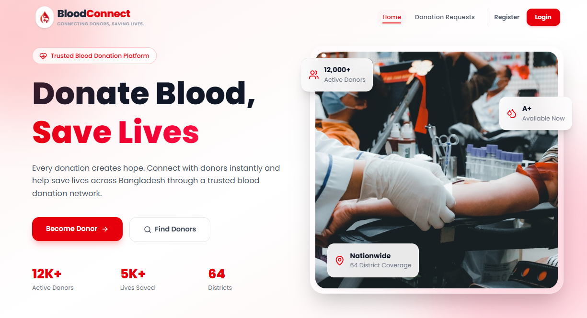
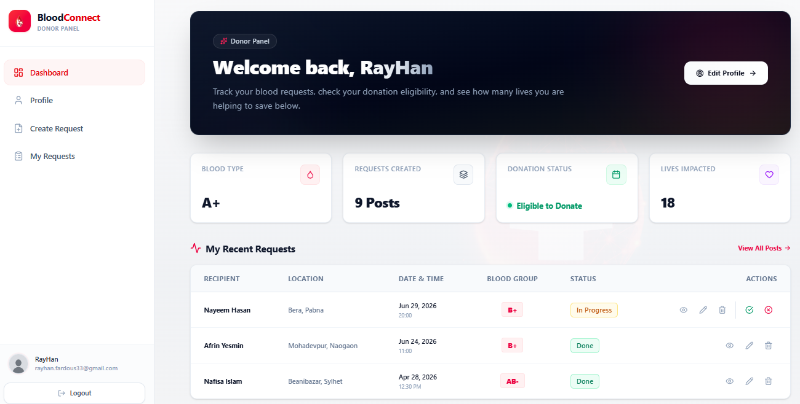
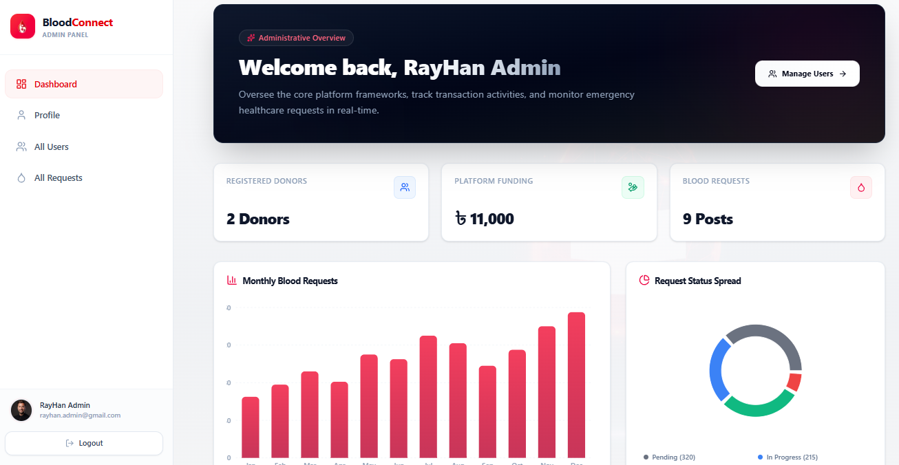
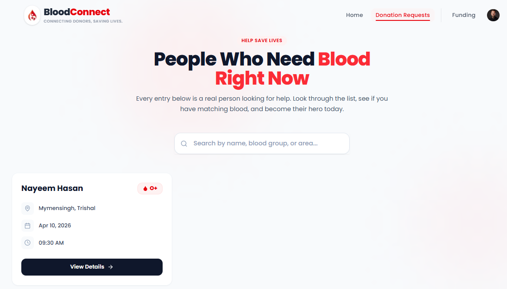
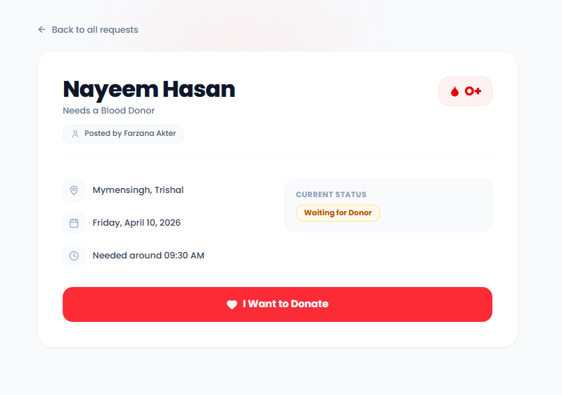
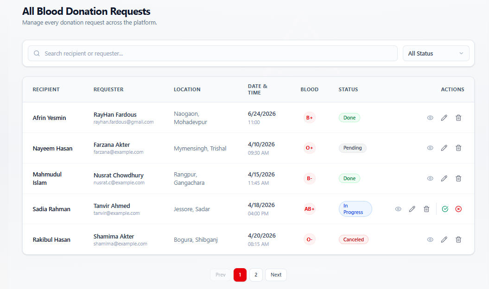
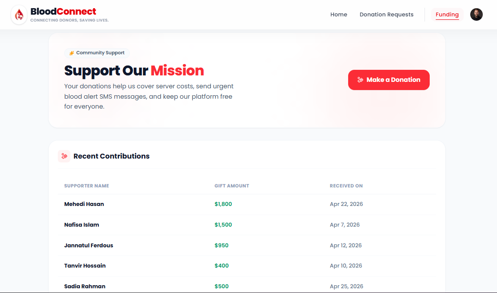

# 🩸 Blood Connect

> **A modern blood donation management system that helps connect blood donors with recipients while providing powerful management tools for administrators and volunteers.**

---

## 🌐 Overview

Blood Connect is a full-stack web application developed to simplify the blood donation process. It enables people to request blood during emergencies, allows eligible donors to respond to requests, and provides administrators and volunteers with the tools needed to efficiently manage the platform.

The application also includes an online funding system, real-time dashboard analytics, secure authentication, and role-based permissions to ensure a smooth and secure user experience.

---

## 🔗 Project Links

- 🌐 **Live Site:** https://blood-connect-liart.vercel.app
- 💻 **Client Repository:** https://github.com/rayhan-fardous/blood-connect-client
- ⚙️ **Server Repository:** https://github.com/rayhan-fardous/blood-connect-server

---

## 📸 Screenshots

### 🏠 Home Page


### 👤 Donor Dashboard


### 👨‍💼 Admin Dashboard


### 🩸 Donation Request


### 📋 My Donation Requests


### 📑 All Requests


### 💰 Funding


---

# ✨ Features

## 🔑 Secure Authentication

* User registration and login using Better Auth.
* Protected routes for authenticated users.
* Role-based authorization for:

  * Donor
  * Volunteer
  * Administrator
* Account blocking and permission management.

---

## ❤️ Donor Features

Registered donors can:

* Create blood donation requests.
* Edit or delete their own requests.
* View donation history.
* Track request status.
* Update personal profile information.
* Accept eligible blood requests.
* Make financial contributions through Stripe.

---

## 👨‍💼 Administrator Dashboard

Administrators have complete control over the platform, including:

* Manage all registered users.
* Promote or demote user roles.
* Block or unblock accounts.
* View every blood donation request.
* Monitor donation statistics.
* View funding information.
* Access dashboard charts and analytics.

---

## 🤝 Volunteer Dashboard

Volunteers can assist with platform operations by:

* Viewing all blood requests.
* Updating request status.
* Managing ongoing donation activities.
* Monitoring overall donation statistics.

---

## 🔍 Public Blood Request Search

Visitors can search for available blood requests without creating an account.

Search filters include:

* Blood Group
* District
* Upazila

Only active requests are displayed.

Detailed request information is available after user authentication.

---

## 💳 Online Donation System

Integrated Stripe Checkout allows users to financially support the platform.

Features include:

* Secure payment processing
* Payment success confirmation
* Automatic donation record storage
* Live funding updates on dashboards

---

## 📈 Dashboard Analytics

Interactive charts provide insights such as:

* Total Users
* Total Blood Requests
* Total Funding
* Monthly Request Statistics
* Request Status Distribution

---

## 👤 Profile Management

Users can:

* Update name
* Upload or change profile image
* Change blood group
* Update district and upazila
* View account information

Email addresses remain protected and cannot be modified.

---

## 🎨 User Experience

* Responsive design for all devices
* Clean and modern interface
* Dark & Light mode support
* Animated components
* Toast notifications
* Loading indicators
* Form validation
* Error handling

---

# 🛠 Technology Stack

| Category        | Technologies                       |
| --------------- | ---------------------------------- |
| Frontend        | Next.js 15, React 19, Tailwind CSS |
| Backend         | Express.js, Node.js                |
| Database        | MongoDB Atlas                      |
| Authentication  | Better Auth                        |
| Payment         | Stripe Checkout                    |
| Charts          | Recharts                           |
| Icons           | Lucide React                       |
| Notifications   | React Hot Toast                    |
| Deployment      | Vercel                             |
| Version Control | Git & GitHub                       |

---

# 📦 Main Packages

### Frontend

* next
* react
* react-dom
* tailwindcss
* lucide-react
* recharts
* react-hot-toast
* better-auth
* @better-auth/mongodb-adapter
* @stripe/react-stripe-js
* @stripe/stripe-js

### Backend

* express
* mongodb
* stripe
* dotenv
* cors
* cookie-parser

---

# 🚀 Installation

## Clone the repository

```bash
git clone https://github.com/rayhan-fardous/blood-connect-client
```

---

## Environment Variables

### Client

```env
BETTER_AUTH_SECRET=
BETTER_AUTH_URL=

MONGODB_URI=

NEXT_PUBLIC_BASE_URL=

NEXT_PUBLIC_STRIPE_PUBLISHABLE_KEY=
STRIPE_SECRET_KEY=

```

### Server

```env
MONGODB_URI=

STRIPE_SECRET_KEY=
```

---

## Run Development Server

### Frontend

```bash
npm run dev
```

### Backend

```bash
npm run server
```

---

# 🔒 User Roles

### Donor

* Register account
* Manage own requests
* Accept donation requests
* Update profile
* Donate funds

### Volunteer

* View all requests
* Update request status
* Assist donors and recipients

### Administrator

* Full user management
* Role management
* Request management
* Funding overview
* Platform analytics

---

# 👨‍💻 Developer

Developed as a full-stack web application using the MERN ecosystem with Next.js, secure authentication, and Stripe payment integration.

---

## ⭐ Support

If you found this project useful, consider giving it a ⭐ on GitHub. It helps others discover the project and motivates future improvements.
