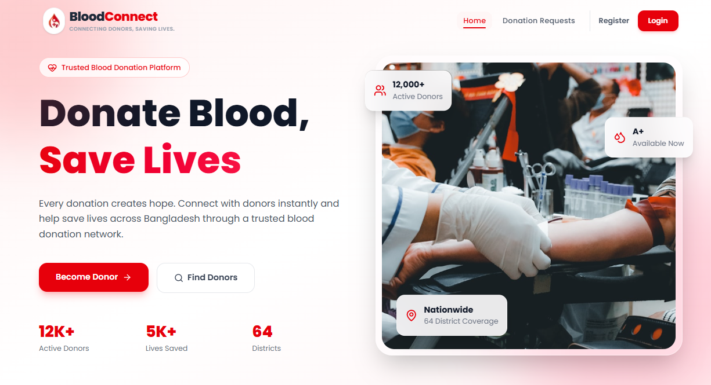
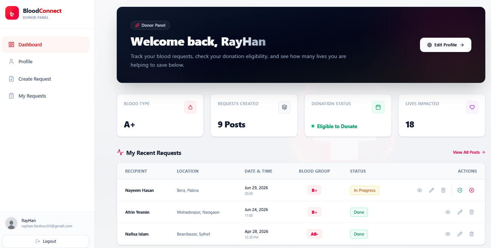
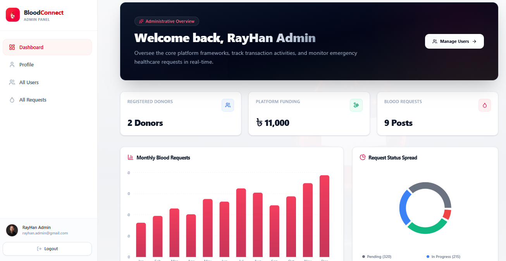
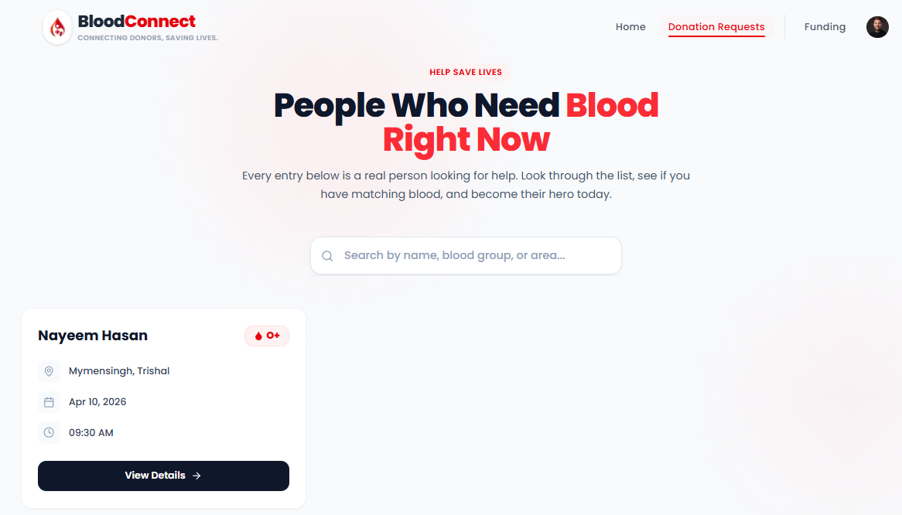
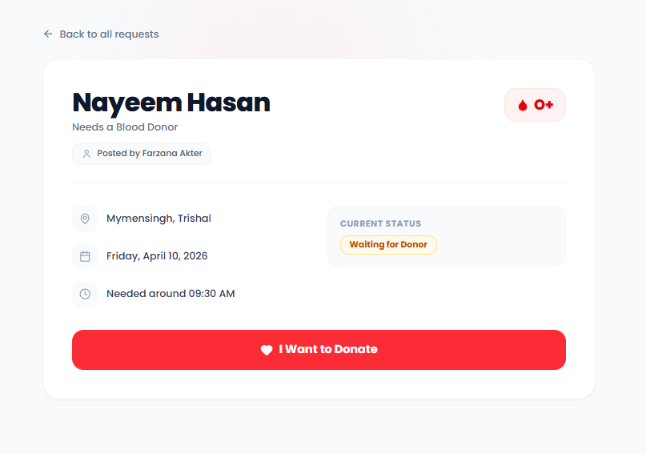
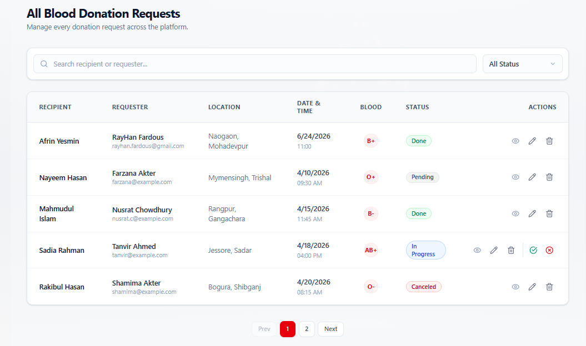
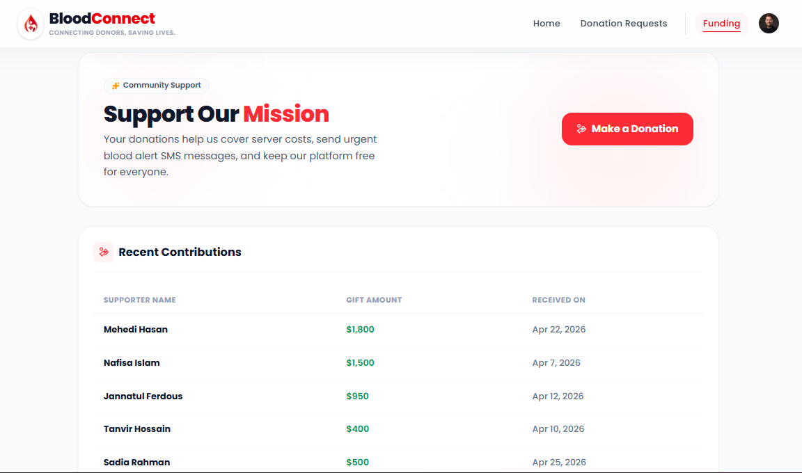

# 🩸 BloodConnect

[](https://nextjs.org/)
[](https://react.dev/)
[](#license)

BloodConnect is a responsive blood-donation platform that helps connect blood donors with people in need. The client application provides a clear public search experience, secure account access, role-based dashboards, donation-request management, funding support, and practical tools for coordinating urgent requests.

## Live Project & Repositories

- **Live application:** [blood-connect-liart.vercel.app](https://blood-connect-liart.vercel.app)
- **Client repository:** [rayhan-fardous/blood-connect-client](https://github.com/rayhan-fardous/blood-connect-client)
- **Server-side repository:** [rayhan-fardous/blood-connect-server](https://github.com/rayhan-fardous/blood-connect-server)

## Key Features

- Search active blood requests by blood group, district, and upazila.
- Register and sign in securely with Better Auth, including Google sign-in support.
- Create, update, track, and manage donation requests.
- Match compatible donor and recipient blood groups, with urgency-aware request information.
- Use dedicated donor, volunteer, and administrator dashboards with role-based access.
- Manage profiles, user roles, account status, request activity, and operational data.
- Contribute to the platform through Stripe Checkout.
- View donation, request, and funding statistics through dashboard analytics.
- Use a responsive interface with light/dark mode, validation, feedback toasts, and loading states.

## Technology Stack

| Area | Technologies |
| --- | --- |
| Framework | Next.js 16, React 19 |
| Styling & UI | Tailwind CSS 4, HeroUI, Framer Motion |
| Authentication | Better Auth, MongoDB adapter |
| Database | MongoDB Atlas |
| Payments | Stripe Checkout |
| Analytics | Recharts |
| AI assistance | Gemini API |
| Server | Node.js, Express |
| Deployment | Vercel |

## Screenshots

### Home



### Donor Dashboard



### Administrator Dashboard



### Donation Requests



### My Requests



### All Requests



### Funding



## Getting Started

### Prerequisites

- Node.js 20 or later
- npm
- A MongoDB Atlas database
- Stripe API keys (for payments)
- Google OAuth credentials (for Google sign-in)
- A Gemini API key (for AI-powered features)

### 1. Clone and install

```bash
git clone https://github.com/rayhan-fardous/blood-connect-client.git
cd blood-connect-client
npm install
```

### 2. Configure environment variables

Create a `.env.local` file in the project root:

```env
BETTER_AUTH_SECRET=your_secure_auth_secret
BETTER_AUTH_URL=http://localhost:3000

MONGODB_URI=your_mongodb_connection_string

GOOGLE_CLIENT_ID=your_google_client_id
GOOGLE_CLIENT_SECRET=your_google_client_secret

NEXT_PUBLIC_BASE_URL=http://localhost:5000
NEXT_PUBLIC_FRONTEND_URL=http://localhost:3000

NEXT_PUBLIC_STRIPE_PUBLISHABLE_KEY=your_stripe_publishable_key
STRIPE_SECRET_KEY=your_stripe_secret_key

GEMINI_API_KEY=your_gemini_api_key
```

`NEXT_PUBLIC_BASE_URL` must point to the BloodConnect server API. For local development, clone and run the [server-side project](https://github.com/rayhan-fardous/blood-connect-server) separately.

### 3. Run the development server

```bash
npm run dev
```

Open [http://localhost:3000](http://localhost:3000) in your browser.

## Available Scripts

| Command | Description |
| --- | --- |
| `npm run dev` | Start the Next.js development server. |
| `npm run build` | Create an optimized production build. |
| `npm run start` | Start the production server after building. |
| `npm run lint` | Run ESLint checks. |

## Server-side Setup

The Express API, MongoDB data access, and related endpoints are maintained in the separate [BloodConnect server repository](https://github.com/rayhan-fardous/blood-connect-server). Follow that repository's setup instructions, set `NEXT_PUBLIC_BASE_URL` to its running URL, and start it before using features that require API data.

## Contributing

Contributions are welcome. Please fork the repository, create a focused branch, make your change, verify it locally, and open a pull request with a concise description.

## License

This project is licensed under the ISC License.
